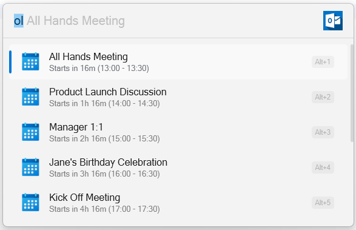

## Microsoft Outlook Integration for Flow Launcher

This plugin enables seamless integration of Microsoft Outlook with [Flow Launcher](https://www.flowlauncher.com/), allowing you to access your upcoming meetings and appointments directly from the launcher.

> ⚠️ **Note:** A local installation of Microsoft Outlook is required for this plugin to work.

### 🔧 Installation

Install the plugin using Flow Launcher's package manager: `pm install Microsoft Outlook`

### 🚀 Usage

1. Open Flow Launcher.
2. Type the keyword: `ol`
3. The plugin will activate and display a list of all your upcoming Outlook Calendar events.

Press Enter or click on any meeting to open it directly in Microsoft Outlook from within Flow Launcher.